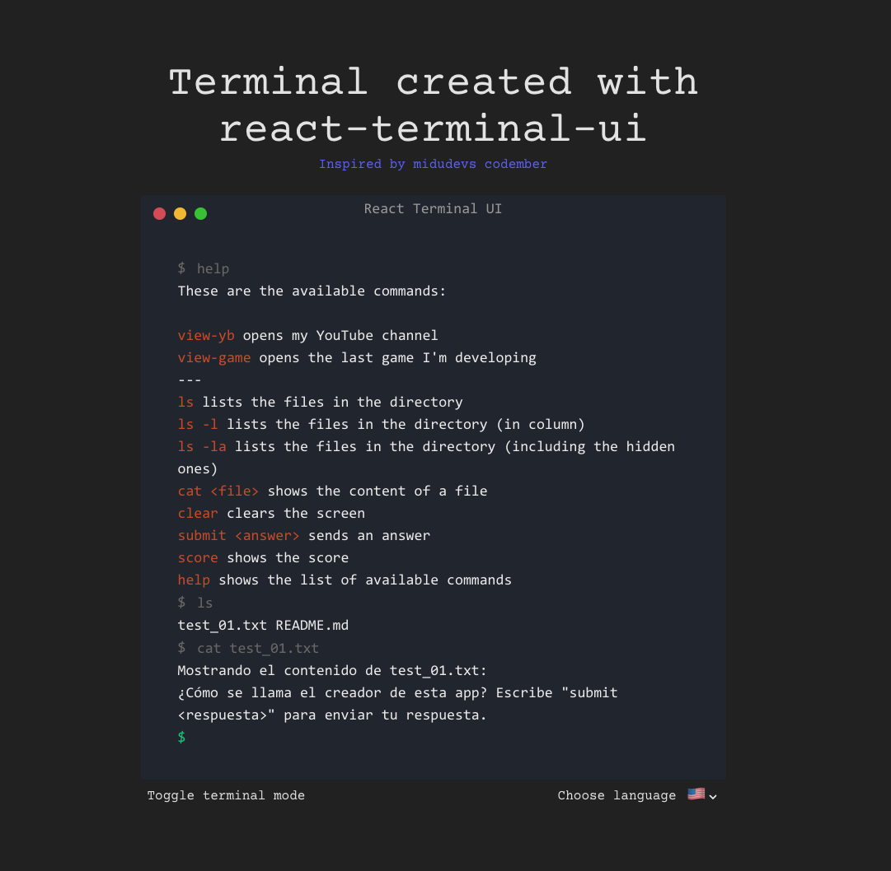

# React Terminal UI

Cool Terminal created using react-terminal-ui inspired by midudev's [codember](https://codember.dev/)
Find the deployment [here](https://react-terminal-ui.vercel.app/)

## 🚀 Aim of the app

Hide different rewards and create different challenges by using and creating your own terminal commands. For the moment, there are only a few challenges, but I will try to keep it updated and of course open source.

## 🔮 Next ToDos

- [ ] Finish translation into German and English of existing content
- [ ] Add keyboard handling to suggest last submitted options when pressing arrow key
- [ ] Add 'cd' functionality to access folders (both coming into and coming out)
